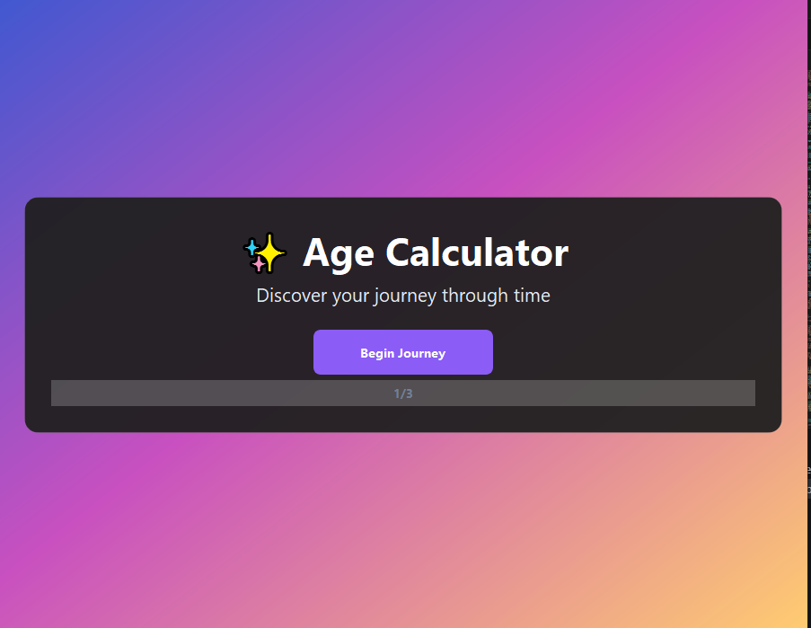
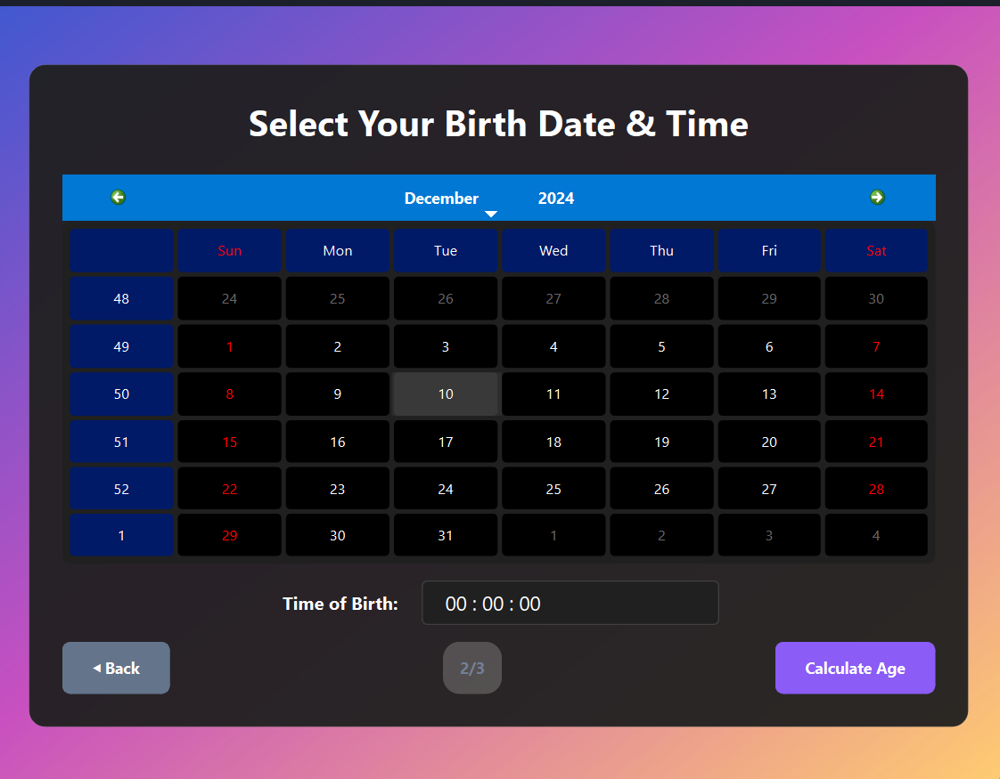
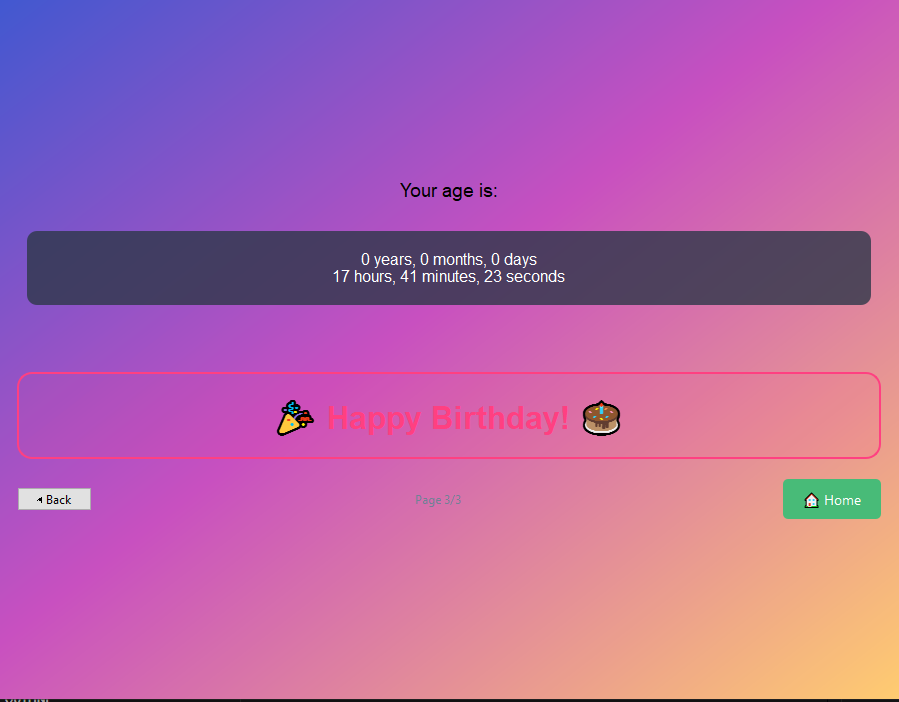

# age_calculator

## Description
This is an age calculator app built using PyQt6 in Python. It allows users to select their date of birth and input their time of birth. The app calculates the user's age and displays it. If today is the user's birthday, the app wishes them a happy birthday.

## Images

## How to Use
1. Open the app.
2. Use the calendar to select your date of birth.
3. Input your time of birth.
4. Click the button to calculate your age.
5. Your age will be displayed on the screen.
6. If today is your birthday, the app will wish you a happy birthday.

## Contributing
If you'd like to contribute to this project, please fork the repository and create a pull request with your changes. 

## License
This project is licensed under the MIT License.
 
 
